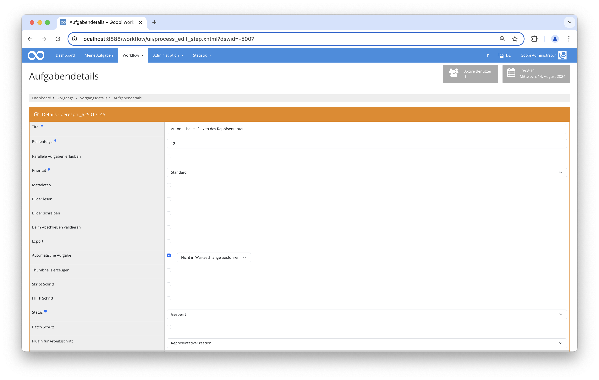

## Einführung
Die vorliegende Dokumentation beschreibt die Installation, Konfiguration und den Einsatz eines Plugins zum Setzen des Repräsentanten innerhalb von METS-Dateien in Goobi.

Mit Hilfe dieses Plugins können METS Dateien automatisch aufbereitet und der Repräsentant eines Werkes gesetzt werden.

## Voraussetzung

Voraussetzung für die Verwendung des Plugins ist der Einsatz von Goobi mindestens in der Version 2.2, die korrekte Installation und Konfiguration des Plugins sowie die korrekte Einbindung des Plugins in die gewünschten Arbeitsschritte der Workflows.


## Installation und Konfiguration
Das Plugin besteht aus zwei Dateien:

```bash
plugin-intranda-step-representative-creator-base.jar
plugin_RepresentativeCreationPlugin.xml
```

Die Datei `plugin-intranda-step-representative-creator-base.jar` enthält die Programmlogik und muss für den tomcat-Nutzer lesbar in folgendes Verzeichnis installiert werden:

```bash
/opt/digiverso/goobi/plugins/step/
```

Die Datei `plugin_RepresentativeCreationPlugin.xml` muss ebenfalls für den tomcat-Nutzer lesbar sein und in folgendes Verzeichnis installiert werden:

```bash
/opt/digiverso/goobi/config/
```

Folgende Datei dient zur Konfiguration des Plugins und muss wie folgt aufgebaut sein:

```xml
<config_plugin>
    <RepresentativeStructureElement>TitlePage</RepresentativeStructureElement>
    <ErrorMessage>Strukturelement zum setzen des Repräsentanten konnte nicht gefunden werden.</ErrorMessage>
    <StepName>Bibliographic import</StepName>
</config_plugin>
```

Im Element `<RepresentativeStructureElement>` kann das Strukturelement definiert werden, dessen erste Seite als Repräsentant genutzt werden soll. Es handelt sich hierbei um den im Regelsatz definierten internen Namen des `<DocStrctType>` Elements.

Der Text aus `<ErrorMessage>` wird in das Vorgangslog des Prozesses geschrieben, falls in der METS-Datei kein Strukturelement mit diesem Namen gefunden wurde. Falls das Element fehlt oder leer ist, wird kein Eintrag vorgenommen.

Mit `<StepName>` kann definiert werden, zu welchem Schritt der Vorgang zurückgedreht werden soll, falls das definierte Strukturelement fehlt. Falls das Element fehlt oder leer ist, kann die Funktionalität zur Fehlerbehandlung deaktiviert werden. Dann findet keine Korrektur innerhalb des Prozesses statt und das erste Bild des Vorgangs wird im Goobi viewer als Repräsentant genutzt. Falls ein Schritt definiert wurde, der im Vorgang nicht existiert, bleibt das Plugin im aktuellen Vorgang stehen.


## Überblick und Funktionsweise
Nachdem das Plugin installiert und konfiguriert wurde, kann es innerhalb eines Arbeitsschrittes von Goobi genutzt werden.

Dazu muss innerhalb der gewünschten Aufgabe das Plugin `RepresentativeCreation` eingetragen werden. Des Weiteren muss die Checkbox `Automatische Aufgabe` gesetzt sein.



Die Arbeitsweise des Plugins innerhalb des korrekt konfigurierten Workflows sieht folgendermaßen aus:

1. Wenn das Plugin innerhalb des Workflows aufgerufen wurde, öffnet es die METS-Datei und prüft als erstes, ob bereits ein Repräsentant definiert wurde.
2. Wenn dies der Fall ist, wird der Schritt abgeschlossen.
3. Ist dies hingegen nicht der Fall, wird nach dem ersten Strukturelement gesucht, das dem konfigurierten Namen entspricht.
4. Von diesem Element wird das erste zugeordnete Bild als Repräsentant gesetzt.
5. Sollte kein Strukturelement mit diesem Namen gefunden werden oder der Datensatz enthält keine Stukturelemente, kann eine Fehlermeldung in das Vorgangslog geschrieben und der Workflow auf einen vorherigen Arbeitsschritt zurückgesetzt werden.
6. Dies ist jedoch nur dann möglich, wenn ein Text für die Fehlermeldung und der Name des Schrittes konfiguriert wurden.